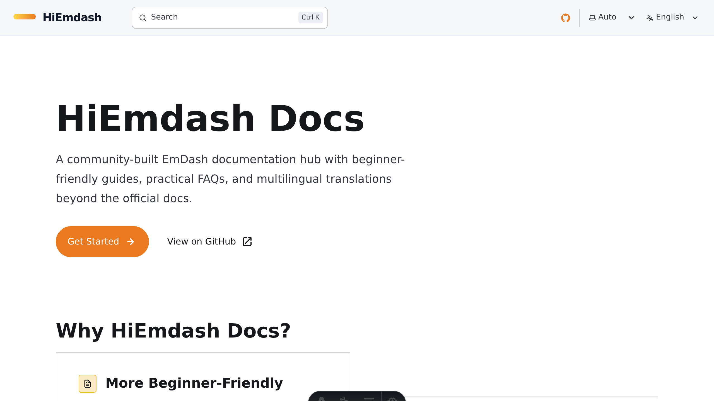

# HiEmdash Docs



HiEmdash Docs is a community-built multilingual documentation site for EmDash. It extends the official documentation with beginner-friendly onboarding, a curated FAQ, and localized translations for multiple languages.

- Production: `https://docs.hiemdash.com`
- Framework: Astro + Starlight
- Runtime: Cloudflare Workers
- Search: Pagefind

## What This Repo Contains

- English source docs plus localized docs for `zh-cn`, `ja`, `ko`, `es`, `pt`, `fr`, and `de`
- Browser-language-aware locale redirect with English as the default root locale
- SEO setup for multilingual docs:
  canonical, `hreflang`, sitemap, robots, OG image, FAQ and breadcrumb structured data
- A DeepSeek-based translation pipeline with segment caching, review passes, glossary support, and validation

## Stack

- [Astro](https://astro.build)
- [Starlight](https://starlight.astro.build)
- [@astrojs/cloudflare](https://docs.astro.build/en/guides/integrations-guide/cloudflare/)
- [Wrangler](https://developers.cloudflare.com/workers/wrangler/)
- [Pagefind](https://pagefind.app/)

## Local Development

Install dependencies:

```bash
pnpm install
```

Start the local dev server:

```bash
pnpm dev
```

Build the production output:

```bash
pnpm build
```

Run tests:

```bash
pnpm test
```

## Translation Workflow

This site does not use Codex itself to translate docs. Translation is generated through DeepSeek, then validated and reviewed inside this repo.

Required environment variables:

```bash
deepseek_api=your_deepseek_api_key
SITE_URL=https://docs.hiemdash.com
```

Translate a locale:

```bash
pnpm translate:zh-cn
pnpm translate:ja
pnpm translate:ko
pnpm translate:es
pnpm translate:pt
pnpm translate:fr
pnpm translate:de
```

Translate the additional locales in sequence:

```bash
pnpm translate:new-locales
```

Validate localized docs:

```bash
pnpm validate:i18n
node ./scripts/validate-translations.mjs --locale ja
```

Normalize terminology using the shared glossary:

```bash
pnpm normalize:terminology
```

## Deployment

This project is configured for Cloudflare Workers, not for a static-only Pages deployment.

Build locally:

```bash
pnpm build
```

Deploy with Wrangler:

```bash
pnpm deploy:cf
```

The Worker configuration lives in [`wrangler.jsonc`](./wrangler.jsonc). Astro generates the deployable Worker bundle into `dist/server` and the static client assets into `dist/client`.

## Project Structure

```text
src/
  content/docs/        English source docs and localized docs
  components/          Shared head and structured data components
  lib/                 Locale, SEO, site, and translation helpers
  pages/               Route files such as robots.txt
public/                Favicons, OG assets, and manifest
scripts/               Translation, validation, glossary, and image tooling
tests/                 Node test suite for locale, SEO, i18n, and glossary logic
```

## Notes

- English is the canonical root locale.
- Other locales are served from language-prefixed paths such as `/zh-cn/`, `/ja/`, and `/fr/`.
- Existing translated content has been manually reviewed to different degrees; `zh-cn` currently has the highest polish.
